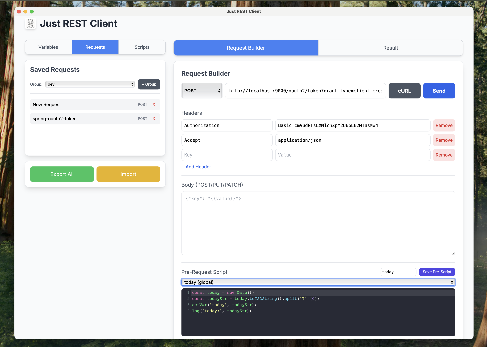

# Just REST Client

<div align="center">
  
</div>

Just REST Client is a lightweight, single-page application (SPA) client built to test and interact with RESTful APIs. It features variable templating, configurable HTTP methods, and a dedicated response viewer for body, headers, and script output.

## 🔗 Usage Options

### Web Version
You can access the live version of the application here:
[https://nicechester.github.io/just-rest-client/](https://nicechester.github.io/just-rest-client/)

### Desktop App (Tauri)
Run as a native desktop application with no CORS restrictions:

```bash
# Terminal 1: Start dev server
cd web && python3 -m http.server 9001

# Terminal 2: Run Tauri
cargo tauri dev

# Build production app (no server needed)
cargo tauri build
```

See [TAURI.md](TAURI.md) for detailed setup instructions.

## ✨ Features

- **Environment Variables**: Manage variables with an intuitive UI, use `{{variableName}}` syntax in URLs, headers, and request bodies.
- **Request Configuration**: Select HTTP methods (GET, POST, PUT, DELETE, PATCH, HEAD) with custom headers and body.
- **Pre-Request Scripts**: Execute JavaScript before sending requests to dynamically set variables.
- **Post-Request Scripts**: Run custom JavaScript after requests to parse responses and extract data.
- **Result Viewer**: Comprehensive view showing both the final processed request and response details with JSON visualization.
- **JSON Viewer**: Interactive, syntax-highlighted JSON visualization for request and response payloads.
- **Save & Organize**: Save requests and scripts for reuse, export/import for backup and sharing.
- **Responsive UI**: Built with Tailwind CSS for optimal viewing on desktop and mobile.

## 🚀 Getting Started

To use the client, follow these steps:

### 1. Configure the Request

- **Select Method**: Choose the desired HTTP method from the dropdown (e.g., GET, POST).
- **Enter URL**: Input the target API endpoint into the URL text box. You can use global variables here (e.g., `{{baseUrl}}/users/{{userId}}`).
- **Request Body**: If using POST, PUT, or PATCH, enter the data payload (e.g., JSON) into the Request Body area.

### 2. Environment Variables (Sidebar)

- **Manage Variables**: Add, view, and delete environment variables using the Variables tab.
- **Defaults**: The application starts with default variables (e.g., `baseUrl`, `token`) for testing.
- **Variable Substitution**: Any string enclosed in double curly braces (`{{...}}`) in URLs, headers, or body is automatically replaced with the corresponding variable value.
- **Persistence**: All variables are saved to localStorage and persist across sessions.

### 3. Pre-Request Scripts

- **Dynamic Variables**: Use pre-request scripts to set or update variables before the request is sent.
- **Example**: Generate timestamps, create authentication signatures, or compute dynamic values.
- **Script Function**: Use `setVar('key', 'value')` to set variables in your script.

```javascript
// Example: Set a timestamp
setVar('timestamp', new Date().getTime());
```

### 4. Post-Request Scripts

- **Extract Data**: Parse response data and save values as variables for subsequent requests.
- **Chain Requests**: Extract tokens, IDs, or other data from responses to use in later requests.
- **Script Functions**: Access `response` (HTTP response object), `responseData` (parsed body), and `setVar()` function.

```javascript
// Example: Extract and save auth token
if (responseData.token) {
    setVar('authToken', responseData.token);
}
```

### 5. Send and View Results

- Click the **Send** button.
- Pre-request scripts execute first (if configured).
- The application processes the request, substitutes variables, and executes the fetch.
- Post-request scripts run after receiving the response.
- The main panel automatically switches to the **Result** tab.

#### Result Details:

- **Request Summary**: Shows the final processed request line, headers, and body (with JSON visualization).
- **Response Body**: Interactive JSON viewer or formatted text showing the server's payload.
- **Response Headers**: All headers returned by the server.
- **Script Output**: Logs from both pre-request and post-request scripts.

## 🛠️ Development & Architecture

The Just REST Client is a modern web application designed with modularity in mind, using ES Modules for separation of concerns.

### Project Structure

The JavaScript logic is divided into the following modules:

- **`app.js`**: The main entry point. Handles UI initialization, state management, and event handlers (like the "Send Request" button click). It orchestrates the flow between the UI and the other modules.
- **`request.js`**: Contains the core logic for executing the fetch request, applying variable templates to the URL and Body, and handling the response and error states.
- **`variable.js`**: Manages the global variable store, providing `setVariable` and `getVariableStore` functions.
- **`scripting.js`**: (Placeholder) Responsible for executing the user-defined JavaScript code after the API request is complete.
- **`storage.js`**: Handles data persistence using `localStorage` for variables, saved requests, and scripts.

### Technologies Used

- **HTML5 / CSS3**
- **JavaScript (ES Modules)**
- **Tailwind CSS**: For utility-first styling and responsive design.

## 📝 Roadmap

Future planned features include:

- Request history with search and filtering.
- Collections/folders for better request organization.
- Support for form data and multipart uploads.
- Authentication helpers (OAuth, API Key, Bearer Token templates).
- Request chaining workflows.
- Dark mode toggle.