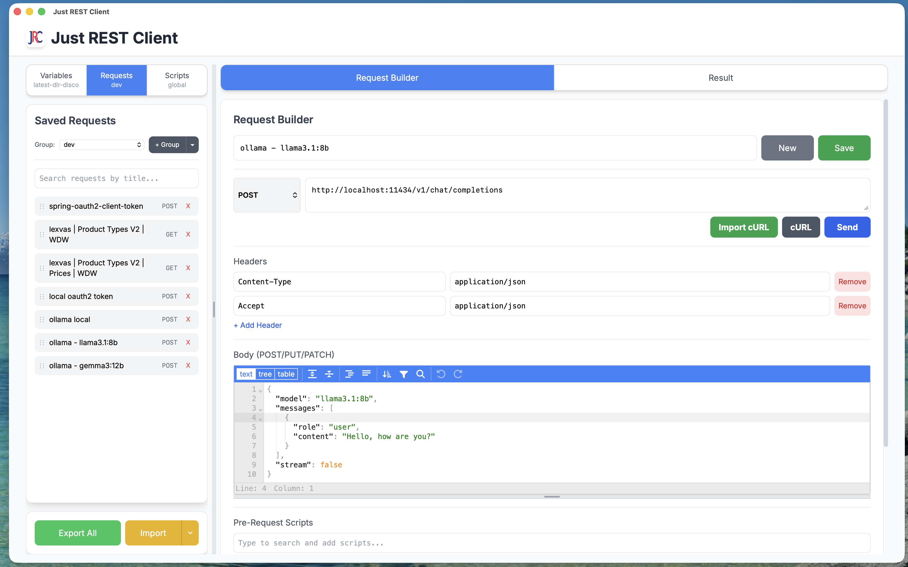

# Just REST Client

<div align="center">
  
</div>

Just REST Client is a lightweight, modern REST API client built to test and interact with RESTful APIs. It features variable templating, configurable HTTP methods, a dedicated response viewer for body, headers, and script output, and an intuitive interface with resizable panes, type-ahead search, and smart script selection.

## 🔗 Usage Options

### Web Version
You can access the live version of the application here:
[https://nicechester.github.io/just-rest-client/web/](https://nicechester.github.io/just-rest-client/web/)

### Desktop App (Tauri)

#### Download Pre-Built Binaries

Download the latest version for your platform from the [Releases page](https://github.com/nicechester/just-rest-client/releases). 

📋 See the [CHANGELOG](CHANGELOG.md) for detailed release notes and version history.

| Platform | File | Size | Notes |
|----------|------|------|-------|
| **macOS** | `Just.REST.Client_*_aarch64.dmg` | ~7 MB | Apple Silicon (M1/M2/M3/M4) |
| **Windows** (Installer) | `Just.REST.Client_*_x64_en-US.msi` | ~6 MB | MSI Installer |
| **Windows** (Portable) | `Just.REST.Client_*_x64-setup.exe` | ~4 MB | Standalone executable |
| **Linux** (Universal) | `Just.REST.Client_*_amd64.AppImage` | ~76 MB | Works on all distros |
| **Linux** (Debian/Ubuntu) | `Just.REST.Client_*_amd64.deb` | ~7 MB | For Debian/Ubuntu |

> **Note for Intel Mac users**: The current release is built for Apple Silicon only. Intel Mac users can [build from source](#build-from-source) or request an Intel build in the [Issues](https://github.com/nicechester/just-rest-client/issues).

**Installation:**
- **macOS**: Download `.dmg`, open it, drag app to Applications folder (Apple Silicon only)
- **Windows**: Download `.msi` and run installer, or use `.exe` for portable version
- **Linux (AppImage)**: Download, make executable (`chmod +x`), and run
- **Linux (Deb)**: Download and install with `sudo dpkg -i Just.REST.Client_*.deb`

#### Build from Source

Run as a native desktop application with **no CORS restrictions**:

```bash
# Development (single command)
./dev.sh

# OR manually in two terminals:
# Terminal 1: Start Vite dev server
npm run dev

# Terminal 2: Run Tauri
npm run tauri:dev

# Build production app
./build.sh

# OR manually:
npm run tauri:build
```

**Benefits of Desktop App:**
- ✅ No CORS restrictions - call any API
- ✅ Better SSL/TLS handling
- ✅ Native performance
- ✅ Offline capable

**Documentation:**
- 📖 [SCRIPTING.md](SCRIPTING.md) - Complete scripting guide with examples
- 📦 [POSTMAN_IMPORT.md](POSTMAN_IMPORT.md) - Import Postman collections guide
- 🏗️ [ARCHITECTURE.md](ARCHITECTURE.md) - Technical architecture and design
- 🖥️ [TAURI.md](TAURI.md) - Desktop app setup and Tauri features

## ✨ Features

### Core Features
- **Environment Variables**: Manage variables with intuitive UI, use `{{variableName}}` syntax in URLs, headers, and bodies
- **Variable Groups**: Organize variables by environment (dev, staging, production) with global scope inheritance
- **Request Configuration**: HTTP methods (GET, POST, PUT, DELETE, PATCH, HEAD) with custom headers and body
- **Result Viewer**: Comprehensive view showing processed request and response with JSON syntax highlighting

### Advanced Scripting
- **Pre-Request Scripts**: Execute JavaScript *before* requests to set variables, fetch tokens, or compute values
- **Post-Request Scripts**: Run JavaScript *after* requests to parse responses and extract data
- **HTTP Client in Scripts**: Make additional HTTP requests from scripts (no CORS in desktop app!)
- **Available Functions**:
  - `getVar(key)` - Read variables
  - `setVar(key, value)` - Write variables
  - `http(url, options)` - Make HTTP requests
  - `log(...args)` - Output logging
  - Full `async/await` support

### Organization & Import/Export
- **Request Collections**: Group API calls by feature, module, or environment
- **Script Libraries**: Organize reusable pre/post-request scripts
- **Export/Import**: Backup and share collections with team members
- **Postman Collection Import**: Import existing Postman collections with variables, requests, and scripts
- **cURL Import**: Paste cURL commands to quickly create requests
- **JSON Viewer**: Interactive, syntax-highlighted visualization

### Developer Experience
- **CodeMirror Editor**: Syntax-highlighted JavaScript editor for scripts
- **cURL Generator**: Export requests as cURL commands
- **Inline Variable Editing**: Click variables to edit inline
- **Custom Modals**: Native-like dialogs for better UX
- **Responsive UI**: Built with Tailwind CSS
- **Resizable Panes**: Draggable divider between sidebar and main content with persistent sizing
- **Type-Ahead Script Selector**: Quick script selection with autocomplete and keyboard navigation
- **Active Group Display**: Visual indication of current group below each tab
- **Smart Script Filtering**: Only shows relevant scripts (active group + global) in dropdowns
- **Search Functionality**: Search across variables, requests, and scripts with real-time filtering

## 🚀 Getting Started

To use the client, follow these steps:

### 1. User Interface

- **Resizable Layout**: Drag the vertical divider between the sidebar and main content to adjust pane sizes (persists across sessions)
- **Search**: Use the search bar in each tab (Variables, Requests, Scripts) to quickly filter items
- **Group Management**: Switch between groups using the tabs in the sidebar - the active group name appears below each tab
- **Responsive Design**: The UI adapts to different screen sizes, with vertical layout on mobile devices

### 2. Configure the Request

- **Select Method**: Choose the desired HTTP method from the dropdown (e.g., GET, POST).
- **Enter URL**: Input the target API endpoint into the URL text box. You can use global variables here (e.g., `{{baseUrl}}/users/{{userId}}`).
- **Request Body**: If using POST, PUT, or PATCH, enter the data payload (e.g., JSON) into the Request Body area.

### 3. Environment Variables (Sidebar)

- **Manage Variables**: Add, view, and delete environment variables using the Variables tab.
- **Defaults**: The application starts with default variables (e.g., `baseUrl`, `token`) for testing.
- **Variable Substitution**: Any string enclosed in double curly braces (`{{...}}`) in URLs, headers, or body is automatically replaced with the corresponding variable value.
- **Persistence**: All variables are saved to localStorage and persist across sessions.

### 4. Pre-Request Scripts

- **Dynamic Variables**: Execute JavaScript before the request to prepare data
- **Script Selection**: Use the type-ahead script selector - start typing to filter, use arrow keys to navigate, Enter to select
- **Smart Filtering**: Only scripts from your active group plus the global group are shown (reduces clutter)
- **Use Cases**: 
  - Generate timestamps or dynamic values
  - Fetch OAuth tokens from auth servers
  - Compute signatures or hashes
  - Build complex request payloads
- **Available Functions**: `getVar()`, `setVar()`, `log()`, `http()`

```javascript
// Example: Fetch OAuth token before request
const response = await http('https://auth.api.com/token', {
  method: 'POST',
  headers: { 'Content-Type': 'application/json' },
  body: JSON.stringify({
    client_id: getVar('client_id'),
    client_secret: getVar('client_secret')
  })
});

if (response.status === 200) {
  setVar('access_token', response.data.access_token);
  log('Token obtained:', response.data.access_token);
}
```

### 5. Post-Request Scripts

- **Extract Data**: Parse response and save values as variables
- **Chain Requests**: Extract IDs/tokens and make follow-up requests
- **Validation**: Check response structure and validate data
- **Script Selection**: Same type-ahead selector as pre-request scripts with smart filtering
- **Available Context**: `response`, `responseData`, `getVar()`, `setVar()`, `log()`, `http()`

```javascript
// Example: Extract data and chain request
if (response.status === 200) {
  const userId = responseData.id;
  setVar('user_id', userId);
  
  // Make follow-up request
  const detailsResponse = await http(`https://api.example.com/users/${userId}/details`, {
    headers: {
      'Authorization': `Bearer ${getVar('access_token')}`
    }
  });
  
  setVar('user_name', detailsResponse.data.name);
  log('User loaded:', detailsResponse.data.name);
}
```

**See [SCRIPTING.md](SCRIPTING.md) for complete documentation with more examples.**

### 6. Send and View Results

- Click the **Send** button.
- Pre-request scripts execute first (if configured).
- The application processes the request, substitutes variables, and executes the fetch.
- Post-request scripts run after receiving the response.
- The main panel automatically switches to the **Result** tab.

#### Result Details:

- **Request Summary**: Shows the final processed request line, headers, and body (with JSON visualization).
- **Response Body**: Interactive JSON viewer or formatted text showing the server's payload.
- **Response Headers**: All headers returned by the server.
- **Script Output**: Logs from both pre-request and post-request scripts.

## 🛠️ Development & Architecture

The Just REST Client is a modern web application designed with modularity in mind, using ES Modules for separation of concerns.

### Project Structure

The JavaScript logic is divided into the following modules:

- **`app.js`**: The main entry point. Handles UI initialization, state management, and event handlers (like the "Send Request" button click). It orchestrates the flow between the UI and the other modules.
- **`request.js`**: Contains the core logic for executing the fetch request, applying variable templates to the URL and Body, and handling the response and error states.
- **`variable.js`**: Manages the global variable store, providing `setVariable` and `getVariableStore` functions.
- **`scripting.js`**: (Placeholder) Responsible for executing the user-defined JavaScript code after the API request is complete.
- **`storage.js`**: Handles data persistence using `localStorage` for variables, saved requests, and scripts.

### Technologies Used

- **HTML5 / CSS3**
- **JavaScript (ES Modules)**
- **Tailwind CSS**: For utility-first styling and responsive design.

## 📝 Roadmap

### Implemented ✅

- ✅ Variable groups with global scope inheritance
- ✅ Request collections via groups
- ✅ HTTP client in scripts for request chaining
- ✅ Pre/post-request scripting with full async/await support
- ✅ Resizable panes with persistent sizing
- ✅ Type-ahead search for scripts with keyboard navigation
- ✅ Search functionality across all tabs
- ✅ Active group visibility indicators

### Planned Features

- Request history with search and filtering
- Support for form data and multipart uploads
- GraphQL support
- WebSocket testing
- Environment variable sync across devices
- Dark mode toggle
- Authentication helpers (OAuth 2.0, JWT, API key)

## 🤝 Contributing

Contributions are welcome! Please feel free to submit a Pull Request.

## 📄 License

This project is licensed under the MIT License - see the [LICENSE](LICENSE) file for details.